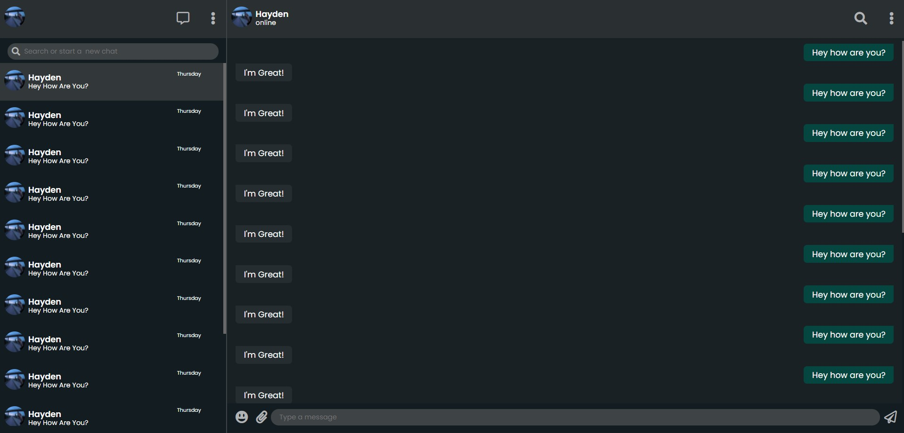

# Whatsapp Web Clone
## Table of contents

- [Overview](#overview)
- [Installation](#installation)
- [Screenshot](#screenshot)
- [Built with](#built-with)
- [Author](#author)

## Overview
Whatsapp Web Clone

### Installation
#### Step 1:

Download or clone this repository

#### Step 2:

Open the index file in the browser

 

### Built with

## Author
 - Hayden Cordeiro   
 
   

